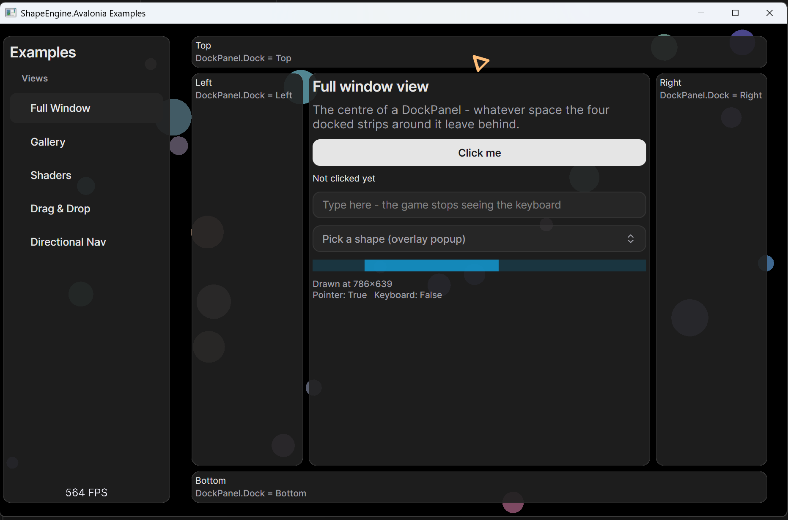
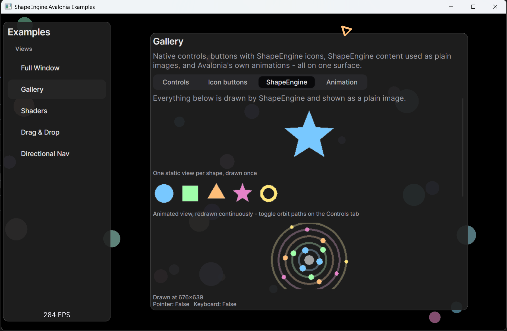
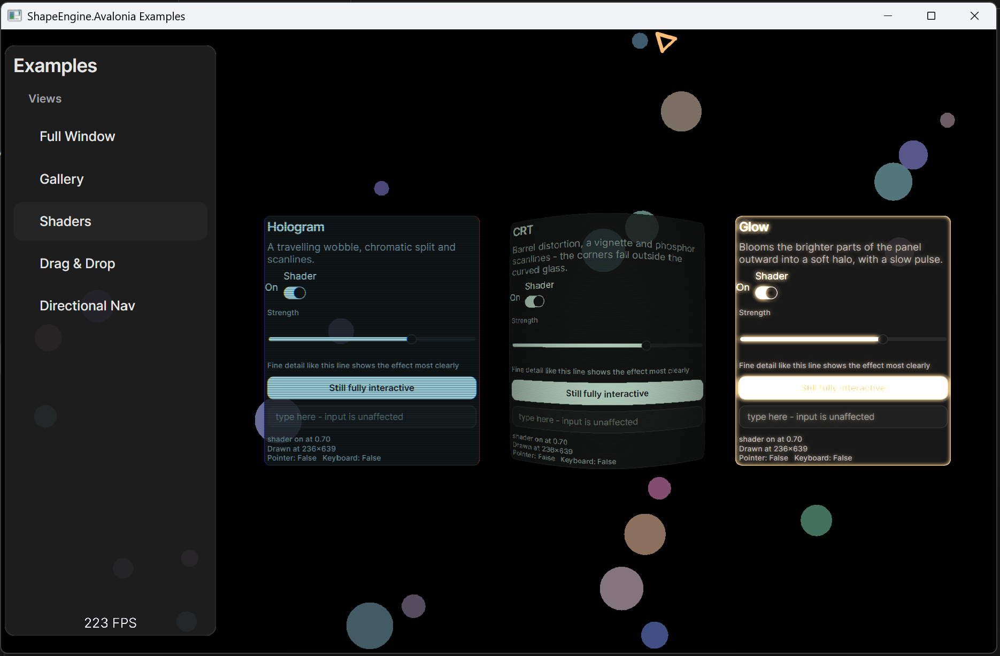
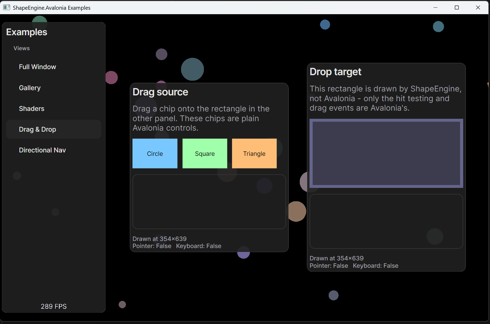
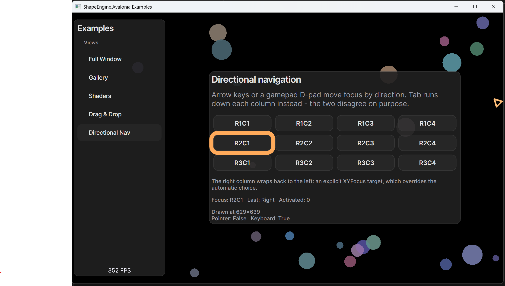

# ShapeEngine.Avalonia

[](https://claude.com/claude-code)

Avalonia UI integration for [ShapeEngine](https://github.com/DaveGreen-Games/ShapeEngine), a 2D game engine built on [raylib](https://www.raylib.com/). It hosts a real Avalonia `TopLevel` inside a ShapeEngine/raylib window and renders it with Skia directly onto the engine's OpenGL surface — no second window, no offscreen hand-off between renderers.

This project uses a similar approach to [Estragonia](https://github.com/youfch/Estragonia)

## Screenshots

| | |
|---|---|
|  DockPanel layout with native Avalonia controls |  ShapeEngine content used as controls, images, and animated views |
|  Shader effects applied to Avalonia panels |  Drag/drop between surfaces, rendered by ShapeEngine |
|  Directional (gamepad/arrow-key) focus navigation | |

## Features

- Display and interact with Avalonia controls within a ShapeEngine/Raylib CS created window.
- Render ShapeEngine content to a texture to be used in an Avalonia control or directly render ShapeEngine content into an Avalonia control.
- Fully support Avalonia animations.
- Multiple separate Avalonia surfaces supported, with drag/drop support between them with ShapeEngine rendering the drag/drop chip.
- High performance GPU rendering of Avlaonia content with an OpenGL context from ShapeEngine/Raylib CS.
- Easily apply shader effects to Avalonia controls.
- Show and hide existing panels as needed — a hidden panel keeps its state but costs nothing while it's off screen.
- Avalonia content can scale with the host window or maintain its relative size and positioning in the window as the window is resized.
- ShapeEngine can draw directly over an Avalonia control's on-screen position, as shown by the animated focus ring in the Directional Nav example.
- Avalonia's thread is the game thread, so interacting is simple.

## Limitations

- Lighly tested, pretty unproven.
- No tests.
- Some Avalonia platform functionality not really implemented such as those for dialogs.
- Avalonia appears to aggravate some known issues with mouse cursor behavior.  See this [PR](https://github.com/DaveGreen-Games/ShapeEngine/pull/180) for more details.
- Input handling could use some refinements, but it may be difficult without changes to ShapeEngine itself.

## How it works

Avalonia normally owns its own window and rendering loop. This project replaces those pieces with ShapeEngine/raylib equivalents so the two can share a single window and a single OpenGL context:

- **`AppBuilderExtensions.UseShapeEngine()`** configures Avalonia to use Skia and HarfBuzz, and swaps in a custom windowing subsystem (`ShapeEnginePlatform`) instead of Avalonia's own.
- **`ShapeEnginePlatform`** binds Avalonia's platform services (clipboard, cursor, dispatcher, keyboard, drag/drop, render timer, etc.) to ShapeEngine/raylib equivalents, and creates the Avalonia compositor bound to raylib's OpenGL context (`Gpu/`). It must be initialized on the game loop thread, after ShapeEngine has created its window.
- **`AvaloniaSurface`** is the main entry point for a game. It creates a `ScreenTexture` and an Avalonia `TopLevel` (`ShapeEngineTopLevel`), renders the Avalonia control tree into that texture each frame, and composites it into the game. Multiple surfaces can coexist, each anchored to a region of the window (`AvaloniaSurfaceAnchor`), with input (mouse/keyboard) arbitrated between the game and whichever surface currently has pointer/keyboard focus.
- **`Controls/`** contains `ShapeEngineTextureView` and friends — Avalonia controls that go the other direction, letting content drawn with ShapeEngine's own drawing functions appear inside an Avalonia visual tree.
- **`Input/`** and **`Storage/`** provide the supporting platform implementations (input pump, keyboard mapping, drag sources, file/folder pickers) that Avalonia expects from its host.

### Minimal usage

```csharp
// After ShapeEngine's Game window has been created:
AppBuilder.Configure<App>()
    .UseShapeEngine()
    .SetupWithoutStarting();

var surface = new AvaloniaSurface(
    content: new MyRootControl(),
    anchor: AvaloniaSurfaceAnchor.FullScreen);
```

## Dependencies

- [.NET 10 SDK](https://dotnet.microsoft.com/download)
- [ShapeEngine](https://www.nuget.org/packages/DaveGreen.ShapeEngine) `5.3.0` (NuGet package `DaveGreen.ShapeEngine`)
- [Avalonia](https://avaloniaui.net/) `12.1.1`, plus `Avalonia.Skia` and `Avalonia.HarfBuzz`

Avalonia is pinned to an exact version rather than a range. Hosting Avalonia inside another renderer requires implementing its platform backend interfaces (`IPlatformRenderSurface` and friends), which Avalonia 12 only exposes through private APIs — opting in requires pinning the exact version those APIs were used from, so an Avalonia upgrade here is a deliberate, tested step rather than an automatic one.

The `ShapeEngine.Avalonia.Examples` project additionally pulls in [ShadUI](https://github.com/accntech/shad-ui) to theme its UI, along with a few more `Avalonia.*` packages (`Themes.Simple`, `Controls.ColorPicker`, `Controls.DataGrid`, `Fonts.Inter`) — none of these are required to use the library itself.

## NuGet?
Not now, and maybe not ever.

Integrating Avalonia like this inverts the natural expectations Avalonia has around input and focus.

I have a strong suspicion that the way it is currently handled is not going to be the way it should work in all games and applications, so I'm leaving that door as open as I can.

## Building

```bash
git clone https://github.com/oshelton/ShapeEngine.Avalonia.git
cd ShapeEngine.Avalonia
dotnet build ShapeEngine.Avalonia.slnx
```

Or open `ShapeEngine.Avalonia.slnx` directly in Visual Studio, Rider, or VS Code with the C# Dev Kit.

### Running the examples

`ShapeEngine.Avalonia.Examples` is the runnable showcase for the screenshots above (`dotnet run --project ShapeEngine.Avalonia.Examples`). Two window-level shortcuts work from anywhere in the app, even mid-edit in a text box:

- `Alt+Enter` — toggle borderless fullscreen.
- `Escape` — quit.

## Project structure

```
ShapeEngine.Avalonia.slnx        Solution file
ShapeEngine.Avalonia/            The library project
├── AppBuilderExtensions.cs      UseShapeEngine() entry point
├── AvaloniaSurface.cs           Hosts an Avalonia TopLevel inside a ShapeEngine game
├── ShapeEnginePlatform.cs       Wires Avalonia's platform services to raylib
├── Controls/                    Controls for drawing ShapeEngine content inside Avalonia
├── Gpu/                         OpenGL context/surface glue between raylib and Skia
├── Input/                       Input pump, keyboard mapping, drag/drop source
└── Storage/                     File/folder picker implementation
```

## License

[MIT](LICENSE)
